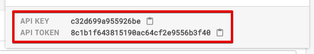

Cacher CLI (Beta)
==========

**Cacher CLI** - The command line interface to [Cacher](https://www.cacher.io), the code snippet organizer for pro 
developers.


[](https://npmjs.org/package/@cacherapp/cli)
[](https://npmjs.org/package/@cacherapp/cli)
[](https://github.com/jookyboi/cli/blob/master/package.json)

The Cacher CLI allows power users to perform common actions on their Cacher libraries.

The beta version is constantly evolving. Check back often for updates and new commands.

## Getting Started

**Prerequisites**
- You've signed up for [Cacher](https://www.cacher.io)
- [Node.js](https://nodejs.org/en/)

**Instructions**

To view your Cacher API credentials, visit:
[https://app.cacher.io/enter?action=view_api_creds](https://app.cacher.io/enter?action=view_api_creds)

Note the API key and token in the Apps dialog footer:



From a terminal window, run:

```bash
npm install -g @cacher/cli
cacher setup
? API key: ****************
? API token: ********************************
``` 

If all goes well, your credentials will be saved and you can execute CLI commands. 

## Commands

* [setup](#setup)
* [snippets:add](#snippetsadd)

### setup

Configure API credentials for Cacher CLI. To view your API token and key visit:
[https://app.cacher.test/enter?action=view_api_creds](https://app.cacher.test/enter?action=view_api_creds)

```
USAGE
  $ cacher setup

OPTIONS
  -k, --key=key      api key for Cacher account
  -t, --token=token  token for Cacher account

EXAMPLES
  cacher setup
  ? API key: ****************
  ? API token: ********************************

  cacher setup --key=fe33cd82ae161ba1 --token=0134a0be884468829669c3be02c3a814
```

_See code: [lib/commands/setup/index.ts](https://github.com/CacherApp/cacher-cli/blob/master/src/commands/setup/index.ts)_

### snippets:add

Add a new snippet to your Cacher personal/team library. By default, creates snippet using clipboard contents. Append `filename` argument to use file contents instead.

```
USAGE
  $ cacher snippets:add [FILENAME]

OPTIONS
  -d, --description=description  snippet description
  -f, --filename=filename        filename for content (will override name of file passed in)
  -m, --team=team                screenname of team library that snippet will be created in
  -q, --quiet                    minimal feedback
  -t, --title=title              snippet title
  -u, --public                   save as public snippet

EXAMPLES
  $ cacher snippets:add
  ? Snippet title: Example from System Clipboard
  ? Description: Snippet created from contents in the clipboard.
  ? Filename: my_file_from_clipboard.md

  $ cacher snippets:add ~/MyCode/example.rb
  ? Snippet title: Example for CLI
  ? Description: This is an example for the Cacher CLI.

  $ cacher snippets:add --filename=my_file_from_clipboard.md \
      --title="Public example from System Clipboard" \
      --description="Snippet created from contents in the clipboard" \
      --team=cacher-dev-ops --public --quiet
```

_See code: [lib/commands/snippets/add.ts](https://github.com/CacherApp/cacher-cli/blob/master/src/commands/snippets/add.ts)_

## Command Help

```bash
cacher help                 # View description and command topics
cacher help snippets        # Help on snippets commands
cacher help snippets:add    # Help and usage for the snippets:add command
```

## Libraries Used

- [oclif](https://oclif.io/) - Heroku's open CLI framework.
- [chalk](https://github.com/chalk/chalk) - Terminal styling for Node.
- [node-copy-paste](https://github.com/xavi-/node-copy-paste) - Cross-platform clipboard support.

## Author / License

Released under the [MIT License](/LICENSE) by [Rui Jiang](https://github.com/jookyboi) of [Cacher](https://www.cacher.io).
